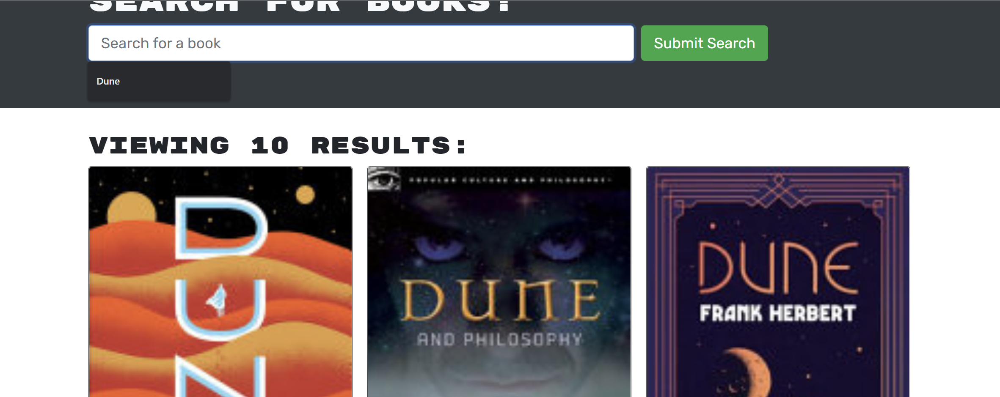
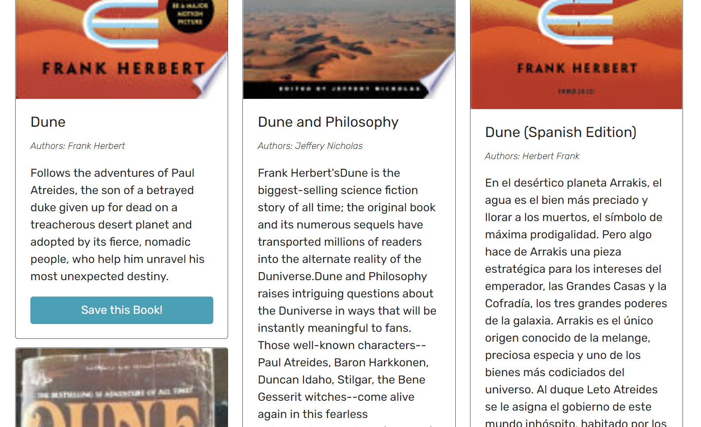
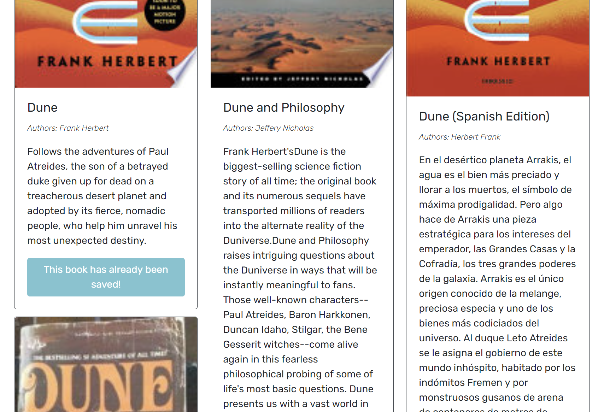

# MagicShelf-BSE

This is a refactored search engine that was originally configured with restful API and is now configured to use GraphQl. It allows the user to create an account, search for books using google's book APi. and if logged in save books that will be stored on the users homepage.

##ScreenShots
This is the page on load.

This is what the search results appearance will be, Dune in this example. (Great Book)

The user posesses the ability to sign up if they so choose.

With an account the user can save a book they've searched for.

A user can look at all of their saved books with the option to remove saves.

Link to deployed site: https://whispering-gorge-60570.herokuapp.com/